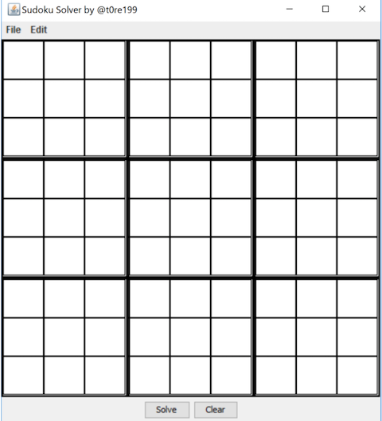
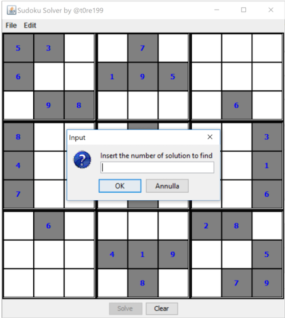
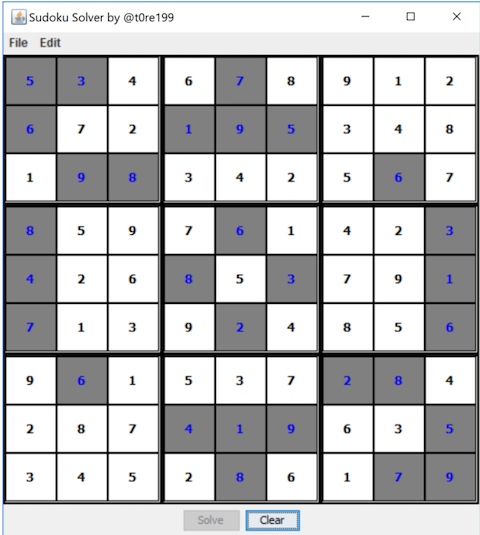

# README #

This is a Java implementation of a Sudoku Solver which uses the **backtraing** algorithm. 
      
Several **Design Patterns** such as:   
* Decorator   
* Composite   
* Builder   
* Abstract Factory   
* Singleton   
* Template Method   
* Proxy   
* Mediator   
* Observer            

and others have been used.  

A GUI has been provided.   

## Requirements ##
JDK >= 1.8 required.   

## UI Examples ##
      

   

   
